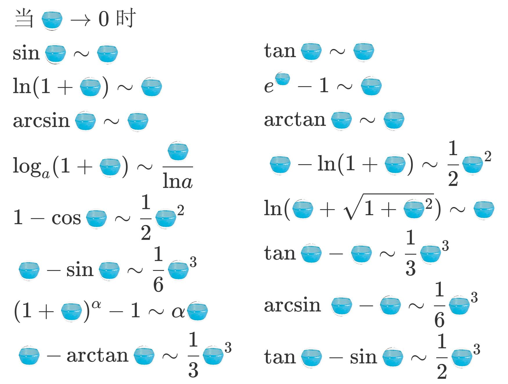

# 无穷小函数的比较

*建议结合极限计算内的极限运算法则来理解*

先定义2个无穷小

$$
\lim{\alpha} = 0,\lim{\beta} =0
$$

## 低阶无穷小

$$
\frac{\lim{\alpha}}{\lim{\beta}}=\lim{\frac{\alpha}{\beta}=\infty}
$$

如果要令这个式子趋于 $\infty$ ，那么 $\lim{\alpha}$ 趋向于0的速度肯定慢于 $\lim{\beta}$ ，此时的 $\alpha$ 是 $\beta$ 的低阶无穷小

## 高阶无穷小

$$
\frac{\lim{\alpha}}{\lim{\beta}}=\lim{\frac{\alpha}{\beta}=0}
$$

如果要令这个式子趋于0，那么 $\lim{\alpha}$ 趋向于0的速度肯定快于 $\lim{\beta}$ ，此时的 $\alpha$ 是 $\beta$ 的高阶无穷小

## 区分高低阶

 - 趋向于0的速率大的无穷小是比式另一边的高阶无穷小
 - 趋向于0的速率小的无穷小是比式另一边的低阶无穷小

$$
\frac{\lim{\alpha}}{\lim{\beta}}=\lim{\frac{\alpha}{\beta}=\infty}
$$

$\alpha$ 是 $\beta$ 的低阶无穷小， $\beta$ 是 $\alpha$ 的高阶无穷小

## K阶无穷小

$$
\frac{\lim{\alpha}}{\lim{\beta^K}}=\lim{\frac{\alpha}{\beta^K}=C}
$$

K阶无穷小就是一个无穷小比上另一个无穷小的K次为常数， $\alpha$ 是 $\beta$ 的K阶无穷小

## 同阶无穷小

同阶无穷小是K阶无穷小的一种情况，此时K=1，也就是

$$
\frac{\lim{\alpha}}{\lim{\beta}}=\lim{\frac{\alpha}{\beta}=C}
$$

### 等价无穷小

等价无穷小是同阶无穷小的一种情况，此时C=1，也就是

$$
\frac{\lim{\alpha}}{\lim{\beta}}=\lim{\frac{\alpha}{\beta}=1}
$$

等价无穷小，说明这两个无穷小趋向于0的速率相当，记作 $\alpha \sim \beta$

#### 等价替换定理

结合洛必达法则来理解

$\lim{\frac{\alpha'}{\beta'}}$ 存在

$$
\frac{\lim{\alpha}}{\lim{\beta}} = \frac{\lim{\alpha'}}{\lim{\beta'}}=\lim{\frac{\alpha'}{\beta'}} = 1
$$

因此可以得到

$$
\lim{\frac{\alpha}{\beta}}=\lim{(\frac{\alpha}{\alpha'}\frac{\alpha'}{\beta'}\frac{\beta'}{\beta})}=\lim{\frac{\alpha'}{\beta'}}
$$

此式说明了积于商中的无穷小可以使用等价无穷小进行替换，从而简化运算

以下是一些常用结论

