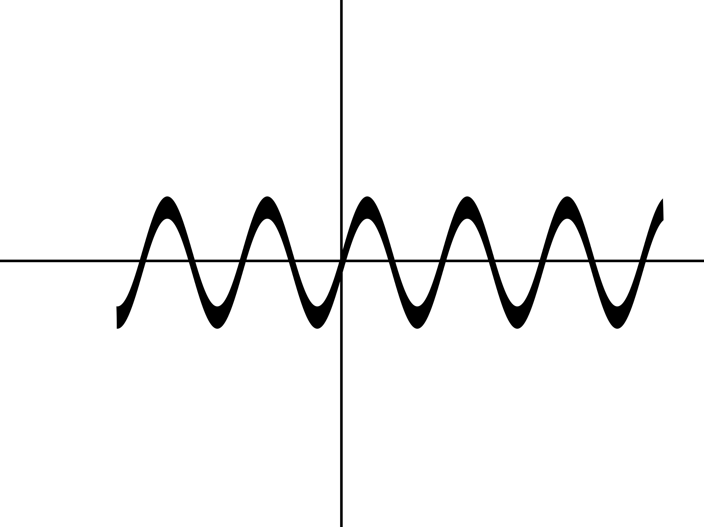
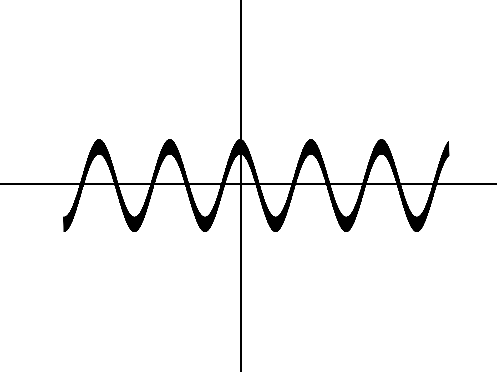
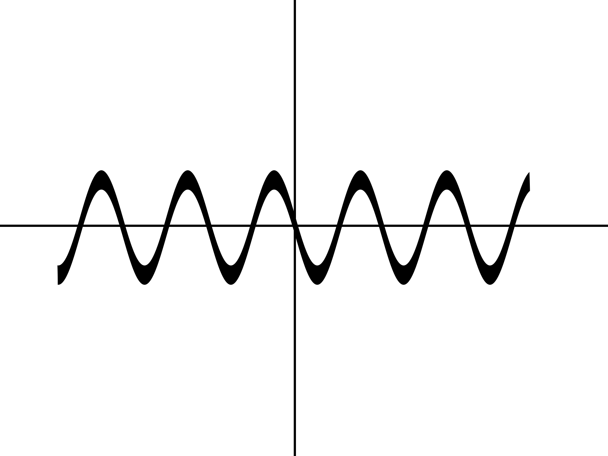

# 凹凸性

## 定义

什么是凹凸性？凹凸性就是函数图像的凹凸，凹凸性变换的点称为拐点

## 判断

### 从 $\sin{x}$ 来看凹凸性

令 $f(x)=\sin{x}$ 

#### $f(x)$ 的图像

#### $f'(x)$ 的图像

$f'(x) = (\sin{x})' = \cos{x}$

#### $f''(x)$ 的图像

$f''(x) = (f'(x))' = (\cos{x})' = -\sin{x}$

此时寻找一下拐点，可以发现拐点是 $x=\frac{k\pi}{2}(k\in N)$，对于 $f(x)$ 来说，这就是凹凸性变化的点，也就是**拐点**

### 总结

从上面的图像还能得出，在二阶导为负数的地方，函数图像上凸，二阶导为正，函数图像下凹
