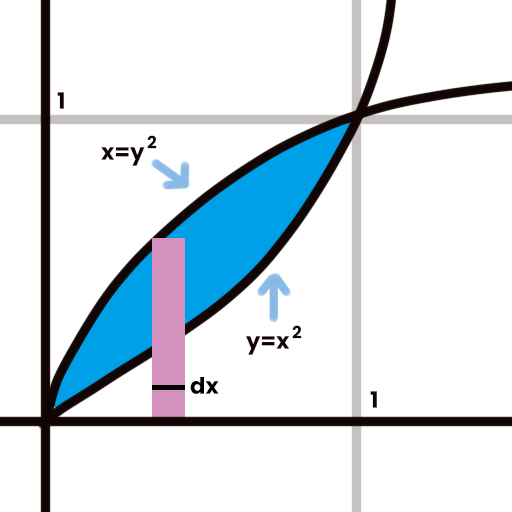

# 应用计算

## 面积

一般要求求出重叠面积，首先可以考虑使用元素法进行列式

首先要进行元素法，我们需要对研究图形进行切割，沿 $y$ 轴切割称之为竖切，沿 $x$ 轴切割称为横切

### 例题

求下图蓝色面积

利用元素法切割，可得宽度为 $dx$，因此需要列出关于 $x$ 的式子 $\int^1_0{(\sqrt{x}-x^2)dx} = \frac{1}{3}$

## 体积

TODO